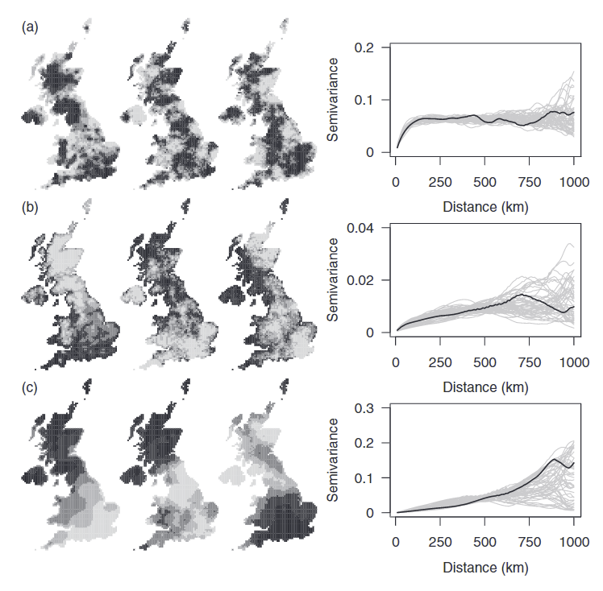
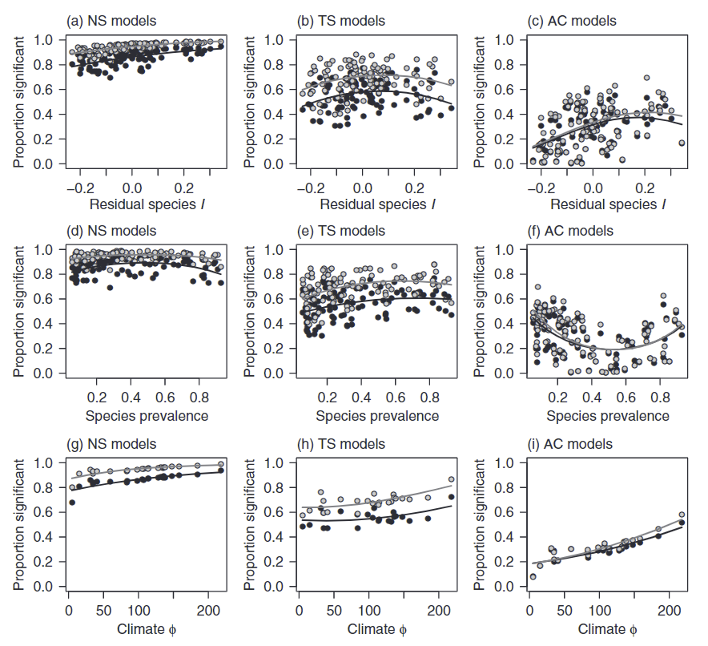
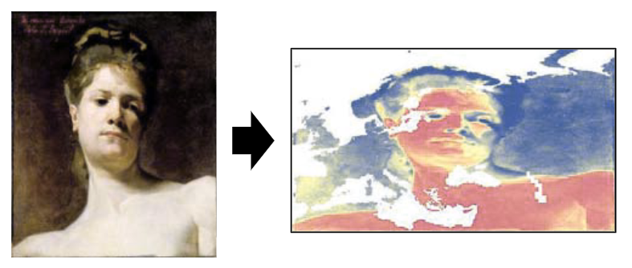
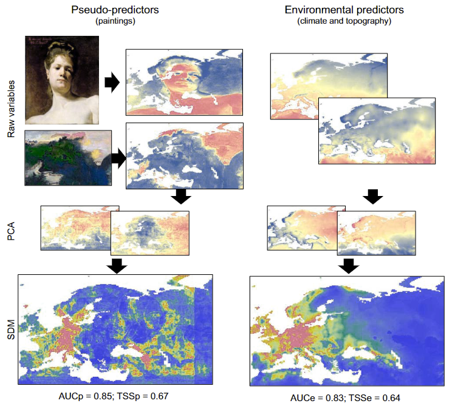

```{r setup, include=FALSE}
knitr::opts_chunk$set(echo = F, warning=F, message=F, cache=T)
```


# Problem

## Problem

\small

**Spatial** or **structural** relationship?


Possible explanations:

1. A direct causal effect
2. An indirect causal effect
3. An accidental spatial association

## Spatial autocorrelation


{height=50%}

## Chapman 2010
\small


{width=40%}

Data:

- 100 UK plant species at 10x10 km grid
- 23 climatic variables
- simulated variables with same properties

Models:

- GLM, random forests
- non-spatial models, trend surfaces, autoregression
- Single predictors, PCA

## Chapman 2010
\small
{height=90%}

## Chapman 2010
\small

{height=90%}

## Fourcade, Besnard, Secondi 2018
\small

{width=80%}

- 497 species from European Red List (GBIF)
- real environmental predictors vs paintings



## Fourcade, Besnard, Secondi 2018
\small

{height=90%}


## Lessons learned:

- The problem is there and it's serious!
- Spatial models cannot successfully beat it.
- It's not a problem for interpolation...
- ...but it is a (big) problem for model projections in space and time.
- The problem is resolved for testing correlation, but not for multiple regression.


# Solution

## Existing solutions (correlation only!)

Parametric solutions:

- Modified sample size (Clifford and Richardson 1985)
- Maximum likelihood test (Vallejos, Osorio, Bevilacqua 2020)

Non-parametric solutions:

- **Basic idea**: keeping one variable fixed, randomizing the other while *keeping its SAC*
- Random shift (Mrkvička et al. 2021)
- Random shuffle and variogram matching (Viladomat et al. 2014)

## My solution

Could the observed relationship be a result of a pure overlay of two independent but autocorrelated variables?


\small

- Keeping one variable (e.g., the response) fixed...
- ...while randomizing the other(s), e.g., the predictor(s)


## Possible randomizations

\small

a) Simulation of new (null) predictors

- you have to know/estimate the SAC function

b) Random shift of the predictor(s)

- you need the predictor as a raster
- random shif / random rotation / random shift & rotation

{width=80%}

## Outputs


## Outputs


## Outputs


# Simulations

## Type I error rate

\small

- Predictor and response simulated **independent**
- Each combination of SAC scales $\rightarrow$ 1000 repetitions $\rightarrow$ rejection rate


## Statistical power

\small

- Response simulated as **dependent** on the predictor:
$$response = predictor + \alpha \cdot error$$
- $predictor$ and $response$ are random fields with given SAC scales
- $\alpha$ controls the signal-to-noise ratio:

{width=60%}

## Statistical power


# Real data example

## Data

\small

::::{.columns}
:::{.column}

Species data:

- sPlotOpen vegetation plot database 
- **species richness** for Europe (~ 35,000 records)

{height=60%}

:::
:::{.column}

Environmental data:

- December mean **wind speed** from Worldclim


:::
::::

## Europe-wise results


## Individual countries


## Selected countries


## Random shift and rotation:

