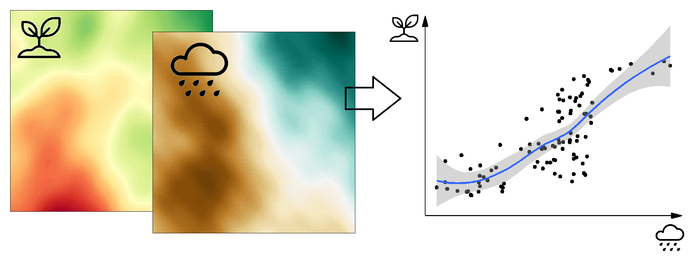
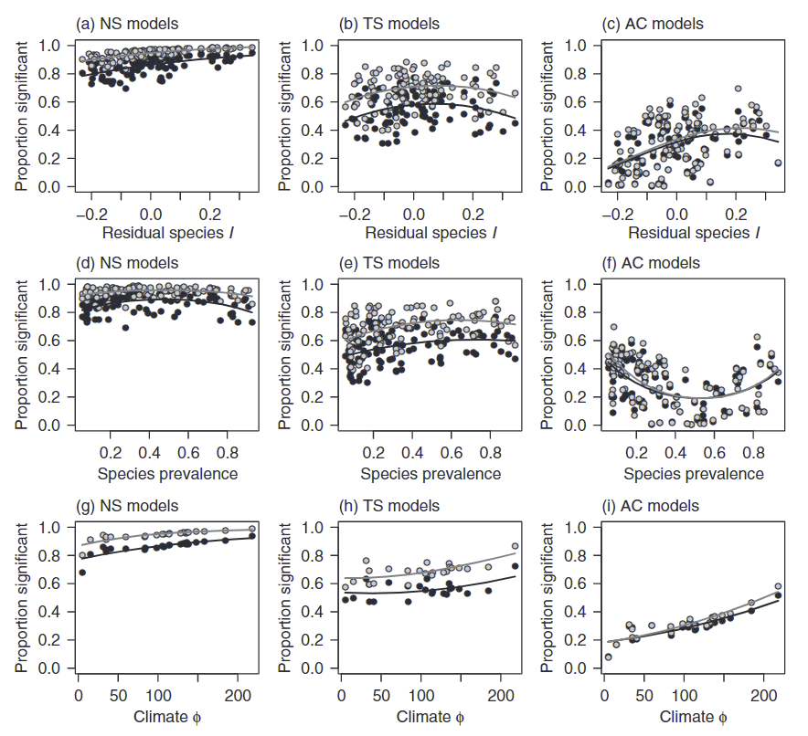
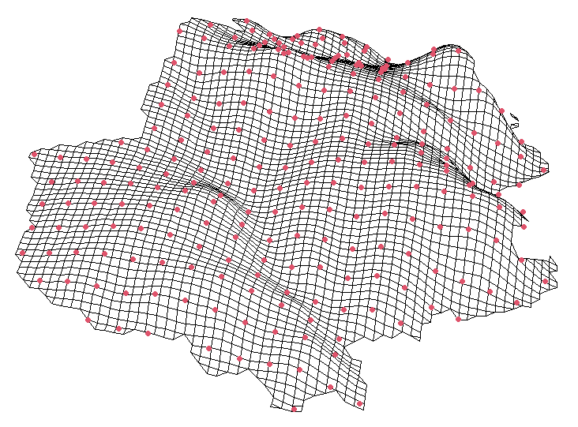

```{r setup, include=FALSE}
knitr::opts_chunk$set(echo = TRUE, warning=F, message=F, cache=T)
```

```{r, echo=F}
library(tidyverse)
```


# Spatial autocorrelation and why it matters

## Types of data in spatial statistics

- Geostatistical data
- Point pattern data
- Areal (lattice) data

## Problem with spatially autocorrelated data

\small

**Spatial** or **structural** relationship?



Possible explanations:

1.  A direct causal effect
2.  An indirect causal effect
3.  An accidental spatial association

## Chapman 2010

\small


{width="40%"}

Data:

-   100 UK plant species at 10x10 km grid
-   23 climatic variables
-   simulated variables with same properties

Models:

-   GLM, random forests
-   non-spatial models, trend surfaces, autoregression
-   Single predictors, PCA

## Chapman 2010

\small

{height="90%"}

## Chapman 2010

\small

{height="90%"}

## Fourcade, Besnard, Secondi 2018

\small

{width="80%"}

-   497 species from European Red List (GBIF)
-   real environmental predictors vs paintings


## Fourcade, Besnard, Secondi 2018

\small

{height="90%"}


# Measuring SAC

## Correlation of two variables
\small

```{r, echo=FALSE, fig.height=1.5, fig.width=2.5}
library(mvtnorm)
m <- c(3.4,5.6)
s <- matrix(c(1,0.8,0.8,1), ncol = 2)
xy <- as.data.frame(rmvnorm(100, mean=m, sigma=s))
ggplot(xy, aes(x=V1, y=V2)) +
  geom_point(size=0.5) +
  geom_smooth(method="lm", se=F, color="red", size=0.5) +
  annotate("segment", x=c(mean(xy$V1), min(xy$V1)), xend=c(mean(xy$V1), max(xy$V1)), y=c(min(xy$V2), mean(xy$V2)), yend=c(max(xy$V2), mean(xy$V2)), 
           lty=2, color="grey50") +
  theme_bw() +
  theme(axis.title.x = element_text(hjust = 1),
        axis.title.y = element_text(hjust = 1, angle=0)) +
  labs(x="X", y="Y") +
  scale_x_continuous(breaks=c(mean(xy$V1)), labels = c(expression(bar(X)))) +
  scale_y_continuous(breaks=c(mean(xy$V2)), labels = c(expression(bar(Y))))
```

Sample covariance: $S_{XY}=\frac{1}{n-1}\sum_{i=1}^n(X_i-\bar{X})(Y_i-\bar{Y})$

Correlation coefficient: $r=\frac{S_{XY}}{S_{X} S_{Y}}$, $-1 \le r \le 1$

$S_X$, $S_Y$ ... sample standard deviations of $X$, $Y$

## Correlation of two variables
\small
[**Mathematical model**](https://distill.pub/2019/visual-exploration-gaussian-processes/): $(X,Y) \sim MVN(\boldsymbol\mu, \boldsymbol\Sigma)$

```{r, echo=FALSE, fig.height=1.5, fig.width=2.5}
data.grid <- expand.grid(V1 = seq(min(xy$V1), max(xy$V1), l=200), V2 = seq(min(xy$V2), max(xy$V2), l=200))
contours <- cbind(data.grid, prob = dmvnorm(data.grid, mean = m, sigma = s))
ggplot(xy, aes(x=V1, y=V2)) +
  geom_point(size=0.5) +
  geom_contour(data=contours, aes(z=prob), alpha=.5, breaks = seq(min(contours$prob), max(contours$prob), l=10)) +
  annotate("segment", x=c(mean(xy$V1), min(xy$V1)), xend=c(mean(xy$V1), max(xy$V1)), y=c(min(xy$V2), mean(xy$V2)), yend=c(max(xy$V2), mean(xy$V2)), 
           lty=2, color="grey50") +
  theme_bw() +
  theme(axis.title.x = element_text(hjust = 1),
        axis.title.y = element_text(hjust = 1, angle=0)) +
  labs(x="X", y="Y") +
  scale_x_continuous(breaks=c(mean(xy$V1)), labels = c(expression(bar(X)))) +
  scale_y_continuous(breaks=c(mean(xy$V2)), labels = c(expression(bar(Y))))
```

Variance matrix: $\boldsymbol\Sigma=\begin{pmatrix}Var(X) & Cov(X,Y)\\Cov(X,Y) & Var(Y)\end{pmatrix}$

Covariance: $Cov(X,Y)=E[(X-E(X))(Y-E(Y))]$

Correlation coefficient: $\rho = \frac{Cov(X,Y)}{\sigma(X)\sigma(Y)}$

## Spatial autocorrelation
\small

Point observations in space:

```{r, echo=F, out.height="30%"}
library(stars)
library(sf)
library(raster)
ras <- read_stars("dtm_CR.tif") %>%
  st_set_crs(5514) %>%
  st_crop(st_read("AdministrativniCleneni_v13.gdb","ObcePolygony", quiet=T) %>% 
            "["(400,))

```

::::{.columns}
:::{.column}

```{r, echo=F, fig.height=1.7, fig.width=1.7}
xy <- expand.grid(x = seq(st_bbox(ras)[1]+500,st_bbox(ras)[3]-500, l=10),
                  y = seq(st_bbox(ras)[2]+500,st_bbox(ras)[4]-500, l=10))
xy$z <- st_extract(ras, as.matrix(xy))[,1]
xy <- dplyr::filter(xy, !is.na(z))
acf2 <- function(lag){
  shift <- matrix(c(rep(50, nrow(xy)), rep(0, nrow(xy))), ncol = 2)
  shift.x <- sample(c(0,lag),size = nrow(xy), replace = T)
  shift.y <- lag-shift.x
  shift <- matrix(c(shift.x,shift.y), ncol = 2)
  xy$z2 <- st_extract(ras, as.matrix(xy[,1:2])+shift)[,1]
  s2 <- var(na.omit(c(xy$z, xy$z2)))
  m <- mean(na.omit(c(xy$z, xy$z2)))
  sum((xy$z-m)*(xy$z2-m), na.rm = T)/((nrow(xy)-1)*s2)
}
lag=100
shift.x <- sample(c(0,lag),size = nrow(xy), replace = T)
shift.y <- lag-shift.x
shift <- matrix(c(shift.x,shift.y), ncol = 2)
xy$z2 <- st_extract(ras, as.matrix(xy[,1:2])+shift)[,1]
s2 <- var(na.omit(c(xy$z, xy$z2)))
m <- mean(na.omit(c(xy$z, xy$z2)))
corr <- sum((xy$z-m)*(xy$z2-m), na.rm = T)/((nrow(xy)-1)*s2)
ggplot(xy, aes(x=z, y=z2)) +
  geom_point(size=.5) +
  theme_bw() +
  theme(axis.title = element_text(size=8),
        title = element_text(size=7),
        axis.text = element_text(size=6)) +
  labs(x="Measurement at a site",
       y="Measurement 100 m away",
       title = bquote(italic(r)==.(round(corr, 2))))
```

::::

## Spatial autocorrelation
\small

Point observations in space:

```{r, echo=F, out.height="30%"}
library(stars)
library(sf)
library(raster)
ras <- read_stars("dtm_CR.tif") %>%
  st_set_crs(5514) %>%
  st_crop(st_read("AdministrativniCleneni_v13.gdb","ObcePolygony", quiet=T) %>% 
            "["(400,))

```

Correlation as a function of distance (correlogram):

```{r, echo=F, fig.height=1, fig.width=3}
lags <- seq(0, 1000, 100)
tac <- sapply(lags, acf2)
ggplot(data.frame(r=tac, lag=lags), aes(x=lag, y=r)) +
  geom_line(size=.3) +
  geom_point(size=.3) +
  theme_bw() +
  labs(x="Distance between the observations", y=expression(italic(r))) +
  theme(axis.title = element_text(angle=0, size=8),
        axis.text = element_text(size=6))
```

- Assumption: the underlying spatial process is **stacionary** and **isotropic**!


## Moran's I
\small

$$I=\frac{n}{\sum_{i=1}^n \sum_{i=1}^n w_{ij}} \frac{\sum_{i=1}^n \sum_{j=1}^n w_{ij} (y_i-\bar{y})(y_j-\bar{y})}{\sum_{i=1}^n(y_i-\bar{y})^2}$$


- $w_{ij}$ measures the magnitude of spatial interactions between sites $i$ and $j$
- originally designed for lattice data!
- Standard metric used for correlograms
- Under the null hypothesis of spatial independence: $E(I) = -1 / (n-1)$
- Alternative measure: Geary's C

## Local Moran's I
\small

The (global) Moran's I can be decomposed into components assossiated with the individual sites:

$$I_i = \frac{(y_i - \bar{y}) \sum_{j=1}^n w_{ij}(y_j-\bar{y})}{\frac{\sum_{j=1}^n(y_i-\bar{y})^2}{n}}$$

$$\sum_{i=1}^nI_i = I$$

## Correlogram

# Gaussian processes, correlation function

## Gaussian (spatial random) process
\small

**Gaussian process**: $\left\{S(x):x\in \mathbb{R}^2\right\}$

For any  $x_1,x_2,...,x_n$ -> $\left\{S(x_1),S(x_2),...,S(x_3)\right\}\sim MVN(\boldsymbol\mu, \boldsymbol\Sigma)$

- $\mu(x) = E\left[S(x)\right]$ ... mean function

- $C(x,x')=Cov\left(S(x),S(x')\right)$ ... covariance function

*Stationary, isotropic process*: $\mu(x)=\mu$, $C(x,x')=C(u)$

We can then define:

- $\sigma^2=C(0)$ ... (constant) variance of the process

<br>

<br>

- $\rho(u)=C(u)/\sigma^2$ ... **correlation function** of the process

## Power-Exponential family
\large

$$\rho(u)=exp\left\{-\left(\frac{u}{\phi}\right)^\kappa\right\}$$

\small
$\phi$ ... scale, $\phi>0$

$\kappa$ ... shape, $0<\kappa\le 2$

::::{.columns}
:::{.column width="50%"}
```{r, echo=F, fig.height=8}
pex <- function(x, nu, phi){ifelse(x==0, 1, exp(-(x/phi)^nu))}
x <- seq(0, 1.5, l=200)
data.frame(
  x=rep(x,3),
  y = c(
    pex(x, 0.7, 0.16),
    pex(x, 1.0, 0.25),
    pex(x, 2.0, 0.43)
  ),
  model=factor(c(rep("m1", length(x)), rep("m2", length(x)), rep("m3", length(x))),
          levels=c("m1","m2","m3"))) %>%
  ggplot(aes(x=x,y=y,lty=model)) + 
  geom_line(size=2) +
  scale_linetype_manual(values=1:3, 
                        labels = c(bquote(kappa==0.7~~phi==0.16),
                                   bquote(kappa=="1.0"~~phi==0.25),
                                   bquote(kappa=="2.0"~~phi==0.43))) +
  labs(linetype="", x=bquote(u), y=bquote(rho(u))) +
  theme_bw() +
  theme(legend.position = c(.7,.7),
        axis.title = element_text(size=30),
        title = element_text(size=28),
        axis.text = element_text(size=26),
        legend.text = element_text(size=30),
        legend.key.width = unit(2,"cm"))
```

:::
:::{.column width="50%"}
```{r, echo=F, fig.height=8}
pex <- function(x, nu, phi){ifelse(x==0, 1, exp(-(x/phi)^nu))}
x <- seq(0, 1.5, l=200)
data.frame(
  x=rep(x,3),
  y = c(
    pex(x, 0.7, 0.1),
    pex(x, 0.7, 0.2),
    pex(x, 0.7, 0.3)
  ),
  model=factor(c(rep("m1", length(x)), rep("m2", length(x)), rep("m3", length(x))),
          levels=c("m1","m2","m3"))) %>%
  ggplot(aes(x=x,y=y,lty=model)) + 
  geom_line(size=2) +
  scale_linetype_manual(values=1:3, 
                        labels = c(bquote(kappa==0.7~~phi==0.1),
                                   bquote(kappa==0.7~~phi==0.2),
                                   bquote(kappa==0.7~~phi==0.3))) +
  labs(linetype="", x=bquote(u), y=bquote(rho(u))) +
  theme_bw() +
  theme(legend.position = c(.7,.7),
        axis.title = element_text(size=30),
        title = element_text(size=28),
        axis.text = element_text(size=26),
        legend.text = element_text(size=30),
        legend.key.width = unit(2,"cm"))
```
:::
::::

## Power-Exponential family
\large

$$\rho(u)=exp\left\{-\left(\frac{u}{\phi}\right)^\kappa\right\}$$

\small
$\phi$ ... scale, $\phi>0$

$\kappa$ ... shape, $0<\kappa\le 2$

```{r, echo=F, fig.height=4}
library(RandomFields)
n <- 400
set.seed(1)
m1 <-  RMpoweredexp(alpha=0.7, var = 1, scale = 0.16) %>%
  RFsimulate(x=seq(0,1,l=n), grid = F) %>%
  slot("data") %>%
  dplyr::pull(variable1)
set.seed(1)
m2 <- RMpoweredexp(alpha=1, var = 1, scale = 0.25) %>%
  RFsimulate(x=seq(0,1,l=n), grid = F) %>%
  slot("data") %>%
  dplyr::pull(variable1)
set.seed(1)
m3 <- RMpoweredexp(alpha=2, var = 1, scale = 0.43) %>%
  RFsimulate(x=seq(0,1,l=n), grid = F) %>%
  slot("data") %>%
  dplyr::pull(variable1)
data.frame(m1=m1,  m2=m2, m3=m3, x = seq(0,1,l=n)) %>%
  pivot_longer(1:3) %>%
  ggplot(aes(x=x, y=value, lty=name)) +
  geom_line(size=.5) +
  theme_bw() +
  labs(x="x", y="S(x)", linetype="") +
  scale_linetype_manual(values=c(2,1,3),
                        labels = c(bquote(kappa==0.7~~phi==0.16),
                                   bquote(kappa=="1.0"~~phi==0.25),
                                   bquote(kappa=="2.0"~~phi==0.43))) +
  theme(legend.position = c(.8,.2))
```

## Power-Exponential family
\small

::::{.columns}
:::{.column width="33%"}
```{r, echo=F, fig.height=9}
library(tmap)
RMpoweredexp(alpha=1, var = 1, scale = 1) %>%
  RFsimulate(x=1:100, y=1:100, grid = T) %>%
  st_as_stars %>%
  tm_shape() +
  tm_raster(style="cont") +
  tm_layout(legend.show = F,
            title = expression(kappa==1~~phi==1),
            title.size = 3)
```
```{r, echo=F, fig.height=9}
RMpoweredexp(alpha=1, var = 1, scale = 5) %>%
  RFsimulate(x=1:100, y=1:100, grid = T) %>%
  st_as_stars %>%
  tm_shape() +
  tm_raster(style="cont") +
  tm_layout(legend.show = F,
            title = expression(kappa==1~~phi==5),
            title.size = 3)
```

:::
:::{.column width="33%"}
```{r, echo=F, fig.height=9}
RMpoweredexp(alpha=1, var = 1, scale = 10) %>%
  RFsimulate(x=1:100, y=1:100, grid = T) %>%
  st_as_stars %>%
  tm_shape() +
  tm_raster(style="cont") +
  tm_layout(legend.show = F,
            title = expression(kappa==1~~phi==10),
            title.size = 3)
```

```{r, echo=F, fig.height=9}
RMpoweredexp(alpha=1, var = 1, scale = 25) %>%
  RFsimulate(x=1:100, y=1:100, grid = T) %>%
  st_as_stars %>%
  tm_shape() +
  tm_raster(style="cont") +
  tm_layout(legend.show = F,
            title = expression(kappa==1~~phi==25),
            title.size = 3)
```
:::
:::{.column width="33%"}
```{r, echo=F, fig.height=9}
RMpoweredexp(alpha=1, var = 1, scale = 50) %>%
  RFsimulate(x=1:100, y=1:100, grid = T) %>%
  st_as_stars %>%
  tm_shape() +
  tm_raster(style="cont") +
  tm_layout(legend.show = F,
            title = expression(kappa==1~~phi==50),
            title.size = 3)
```

```{r, echo=F, fig.height=9}
RMpoweredexp(alpha=1, var = 1, scale = 100) %>%
  RFsimulate(x=1:100, y=1:100, grid = T) %>%
  st_as_stars %>%
  tm_shape() +
  tm_raster(style="cont") +
  tm_layout(legend.show = F,
            title = expression(kappa==1~~phi==100),
            title.size = 3)
```
:::
::::

## Power-Exponential family
\small

::::{.columns}
:::{.column width="33%"}
```{r, echo=F, fig.height=9}
library(tmap)
RMpoweredexp(alpha=2, var = 1, scale = 1) %>%
  RFsimulate(x=1:100, y=1:100, grid = T) %>%
  st_as_stars %>%
  tm_shape() +
  tm_raster(style="cont") +
  tm_layout(legend.show = F,
            title = expression(kappa==2~~phi==1),
            title.size = 3)
```
```{r, echo=F, fig.height=9}
RMpoweredexp(alpha=2, var = 1, scale = 5) %>%
  RFsimulate(x=1:100, y=1:100, grid = T) %>%
  st_as_stars %>%
  tm_shape() +
  tm_raster(style="cont") +
  tm_layout(legend.show = F,
            title = expression(kappa==2~~phi==5),
            title.size = 3)
```

:::
:::{.column width="33%"}
```{r, echo=F, fig.height=9}
RMpoweredexp(alpha=2, var = 1, scale = 10) %>%
  RFsimulate(x=1:100, y=1:100, grid = T) %>%
  st_as_stars %>%
  tm_shape() +
  tm_raster(style="cont") +
  tm_layout(legend.show = F,
            title = expression(kappa==2~~phi==10),
            title.size = 3)
```

```{r, echo=F, fig.height=9}
RMpoweredexp(alpha=2, var = 1, scale = 25) %>%
  RFsimulate(x=1:100, y=1:100, grid = T) %>%
  st_as_stars %>%
  tm_shape() +
  tm_raster(style="cont") +
  tm_layout(legend.show = F,
            title = expression(kappa==2~~phi==25),
            title.size = 3)
```
:::
:::{.column width="33%"}
```{r, echo=F, fig.height=9}
RMpoweredexp(alpha=2, var = 1, scale = 50) %>%
  RFsimulate(x=1:100, y=1:100, grid = T) %>%
  st_as_stars %>%
  tm_shape() +
  tm_raster(style="cont") +
  tm_layout(legend.show = F,
            title = expression(kappa==2~~phi==50),
            title.size = 3)
```

```{r, echo=F, fig.height=9}
RMpoweredexp(alpha=2, var = 1, scale = 100) %>%
  RFsimulate(x=1:100, y=1:100, grid = T) %>%
  st_as_stars %>%
  tm_shape() +
  tm_raster(style="cont") +
  tm_layout(legend.show = F,
            title = expression(kappa==2~~phi==100),
            title.size = 3)
```
:::
::::

## Matérn family
\large

$$\rho(u)=\{2^{\kappa-1}\Gamma(\kappa)\}^{-1}\left(\frac{u}{\phi}\right)^\kappa K_\kappa\left(\tfrac{u}{\phi}\right)$$

\small
$\phi$ ... scale, $\phi>0$

$\kappa$ ... order, $\kappa>0$

$K_\kappa$ ... modifikovaná Besselova funkce druhého typu řádu $\kappa$

::::{.columns}
:::{.column width="50%"}
```{r, echo=F, fig.height=8}
matt <- function(x, nu, phi){ifelse(x==0, 1,(2^(1-nu))*(gamma(nu)^(-1))*(x/phi)^nu*besselK((x/phi), nu))}
x <- seq(0, 1.5, l=200)
data.frame(
  x=rep(x,3),
  y = c(
    matt(x, 0.5, 0.25),
    matt(x, 1.5, 0.16),
    matt(x, 2.5, 0.13)
  ),
  model=factor(c(rep("m1", length(x)), rep("m2", length(x)), rep("m3", length(x))),
          levels=c("m1","m2","m3"))) %>%
  ggplot(aes(x=x,y=y,lty=model)) + 
  geom_line(size=2) +
  scale_linetype_manual(values=1:3, 
                        labels = c(bquote(kappa==0.5~~phi==0.16),
                                   bquote(kappa==1.5~~phi==0.25),
                                   bquote(kappa==2.5~~phi==0.43))) +
  labs(linetype="", x=bquote(u), y=bquote(rho(u))) +
  theme_bw() +
  theme(legend.position = c(.7,.7),
        axis.title = element_text(size=30),
        title = element_text(size=28),
        axis.text = element_text(size=26),
        legend.text = element_text(size=30),
        legend.key.width = unit(2,"cm"))
```
:::
:::{.column width="50%"}
```{r, echo=F, fig.height=8}
matt <- function(x, nu, phi){ifelse(x==0, 1,(2^(1-nu))*(gamma(nu)^(-1))*(x/phi)^nu*besselK((x/phi), nu))}
x <- seq(0, 1.5, l=200)
data.frame(
  x=rep(x,3),
  y = c(
    matt(x, 1.5, 0.1),
    matt(x, 1.5, 0.2),
    matt(x, 1.5, 0.3)
  ),
  model=factor(c(rep("m1", length(x)), rep("m2", length(x)), rep("m3", length(x))),
          levels=c("m1","m2","m3"))) %>%
  ggplot(aes(x=x,y=y,lty=model)) + 
  geom_line(size=2) +
  scale_linetype_manual(values=1:3, 
                        labels = c(bquote(kappa==1.5~~phi==0.1),
                                   bquote(kappa==1.5~~phi==0.2),
                                   bquote(kappa==1.5~~phi==0.3))) +
  labs(linetype="", x=bquote(u), y=bquote(rho(u))) +
  theme_bw() +
  theme(legend.position = c(.7,.7),
        axis.title = element_text(size=30),
        title = element_text(size=28),
        axis.text = element_text(size=26),
        legend.text = element_text(size=30),
        legend.key.width = unit(2,"cm"))
```
:::
::::

## Matérn family
\large

$$\rho(u)=\{2^{\kappa-1}\Gamma(\kappa)\}^{-1}\left(\frac{u}{\phi}\right)^\kappa K_\kappa\left(\tfrac{u}{\phi}\right)$$

\small
$\phi$ ... scale, $\phi>0$

$\kappa$ ... order, $\kappa>0$

$K_\kappa$ ... modifikovaná Besselova funkce druhého typu řádu $\kappa$

```{r, echo=F, fig.height=4}
n <- 400
set.seed(1)
m1 <-  RMwhittle(nu=0.5, var = 1, scale = 0.25) %>%
  RFsimulate(x=seq(0,1,l=n), grid = F) %>%
  slot("data") %>%
  dplyr::pull(variable1)
set.seed(1)
m2 <- RMwhittle(nu=1.5, var = 1, scale = 0.16) %>%
  RFsimulate(x=seq(0,1,l=n), grid = F) %>%
  slot("data") %>%
  dplyr::pull(variable1)
set.seed(1)
m3 <- RMwhittle(nu=2.5, var = 1, scale = 0.13) %>%
  RFsimulate(x=seq(0,1,l=n), grid = F) %>%
  slot("data") %>%
  dplyr::pull(variable1)
data.frame(m1=m1,  m2=m2, m3=m3, x = seq(0,1,l=n)) %>%
  pivot_longer(1:3) %>%
  ggplot(aes(x=x, y=value, lty=name)) +
  geom_line(size=.5) +
  theme_bw() +
  labs(x="x", y="S(x)", linetype="") +
  scale_linetype_manual(values=c(2,1,3),
                        labels = c(bquote(kappa==0.5~~phi==0.25),
                                   bquote(kappa==1.5~~phi==0.16),
                                   bquote(kappa==2.5~~phi==0.13))) +
  theme(legend.position = c(.8,.2))
```

## Matérn family
\small

::::{.columns}
:::{.column width="33%"}
```{r, echo=F, fig.height=9}
library(tmap)
RMwhittle(nu=0.5, var = 1, scale = 1) %>%
  RFsimulate(x=1:100, y=1:100, grid = T) %>%
  st_as_stars %>%
  tm_shape() +
  tm_raster(style="cont") +
  tm_layout(legend.show = F,
            title = expression(kappa==0.5~~phi==1),
            title.size = 3)
```
```{r, echo=F, fig.height=9}
RMwhittle(nu=0.5, var = 1, scale = 5) %>%
  RFsimulate(x=1:100, y=1:100, grid = T) %>%
  st_as_stars %>%
  tm_shape() +
  tm_raster(style="cont") +
  tm_layout(legend.show = F,
            title = expression(kappa==0.5~~phi==5),
            title.size = 3)
```

:::
:::{.column width="33%"}
```{r, echo=F, fig.height=9}
RMwhittle(nu=0.5, var = 1, scale = 10) %>%
  RFsimulate(x=1:100, y=1:100, grid = T) %>%
  st_as_stars %>%
  tm_shape() +
  tm_raster(style="cont") +
  tm_layout(legend.show = F,
            title = expression(kappa==0.5~~phi==10),
            title.size = 3)
```

```{r, echo=F, fig.height=9}
RMwhittle(nu=0.5, var = 1, scale = 25) %>%
  RFsimulate(x=1:100, y=1:100, grid = T) %>%
  st_as_stars %>%
  tm_shape() +
  tm_raster(style="cont") +
  tm_layout(legend.show = F,
            title = expression(kappa==0.5~~phi==25),
            title.size = 3)
```
:::
:::{.column width="33%"}
```{r, echo=F, fig.height=9}
RMwhittle(nu=0.5, var = 1, scale = 50) %>%
  RFsimulate(x=1:100, y=1:100, grid = T) %>%
  st_as_stars %>%
  tm_shape() +
  tm_raster(style="cont") +
  tm_layout(legend.show = F,
            title = expression(kappa==0.5~~phi==50),
            title.size = 3)
```

```{r, echo=F, fig.height=9}
RMwhittle(nu=0.5, var = 1, scale = 100) %>%
  RFsimulate(x=1:100, y=1:100, grid = T) %>%
  st_as_stars %>%
  tm_shape() +
  tm_raster(style="cont") +
  tm_layout(legend.show = F,
            title = expression(kappa==0.5~~phi==100),
            title.size = 3)
```
:::
::::

## Matérn family
\small

::::{.columns}
:::{.column width="33%"}
```{r, echo=F, fig.height=9}
library(tmap)
RMwhittle(nu=1.5, var = 1, scale = 1) %>%
  RFsimulate(x=1:100, y=1:100, grid = T) %>%
  st_as_stars %>%
  tm_shape() +
  tm_raster(style="cont") +
  tm_layout(legend.show = F,
            title = expression(kappa==1.5~~phi==1),
            title.size = 3)
```
```{r, echo=F, fig.height=9}
RMwhittle(nu=1.5, var = 1, scale = 5) %>%
  RFsimulate(x=1:100, y=1:100, grid = T) %>%
  st_as_stars %>%
  tm_shape() +
  tm_raster(style="cont") +
  tm_layout(legend.show = F,
            title = expression(kappa==1.5~~phi==5),
            title.size = 3)
```

:::
:::{.column width="33%"}
```{r, echo=F, fig.height=9}
RMwhittle(nu=1.5, var = 1, scale = 10) %>%
  RFsimulate(x=1:100, y=1:100, grid = T) %>%
  st_as_stars %>%
  tm_shape() +
  tm_raster(style="cont") +
  tm_layout(legend.show = F,
            title = expression(kappa==1.5~~phi==10),
            title.size = 3)
```

```{r, echo=F, fig.height=9}
RMwhittle(nu=1.5, var = 1, scale = 25) %>%
  RFsimulate(x=1:100, y=1:100, grid = T) %>%
  st_as_stars %>%
  tm_shape() +
  tm_raster(style="cont") +
  tm_layout(legend.show = F,
            title = expression(kappa==1.5~~phi==25),
            title.size = 3)
```
:::
:::{.column width="33%"}
```{r, echo=F, fig.height=9}
RMwhittle(nu=1.5, var = 1, scale = 50) %>%
  RFsimulate(x=1:100, y=1:100, grid = T) %>%
  st_as_stars %>%
  tm_shape() +
  tm_raster(style="cont") +
  tm_layout(legend.show = F,
            title = expression(kappa==1.5~~phi==50),
            title.size = 3)
```

```{r, echo=F, fig.height=9}
RMwhittle(nu=1.5, var = 1, scale = 100) %>%
  RFsimulate(x=1:100, y=1:100, grid = T) %>%
  st_as_stars %>%
  tm_shape() +
  tm_raster(style="cont") +
  tm_layout(legend.show = F,
            title = expression(kappa==1.5~~phi==100),
            title.size = 3)
```
:::
::::

## Matérn family
\small

::::{.columns}
:::{.column width="33%"}
```{r, echo=F, fig.height=9}
library(tmap)
RMwhittle(nu=2.5, var = 1, scale = 1) %>%
  RFsimulate(x=1:100, y=1:100, grid = T) %>%
  st_as_stars %>%
  tm_shape() +
  tm_raster(style="cont") +
  tm_layout(legend.show = F,
            title = expression(kappa==2.5~~phi==1),
            title.size = 3)
```
```{r, echo=F, fig.height=9}
RMwhittle(nu=2.5, var = 1, scale = 5) %>%
  RFsimulate(x=1:100, y=1:100, grid = T) %>%
  st_as_stars %>%
  tm_shape() +
  tm_raster(style="cont") +
  tm_layout(legend.show = F,
            title = expression(kappa==2.5~~phi==5),
            title.size = 3)
```

:::
:::{.column width="33%"}
```{r, echo=F, fig.height=9}
RMwhittle(nu=2.5, var = 1, scale = 10) %>%
  RFsimulate(x=1:100, y=1:100, grid = T) %>%
  st_as_stars %>%
  tm_shape() +
  tm_raster(style="cont") +
  tm_layout(legend.show = F,
            title = expression(kappa==2.5~~phi==10),
            title.size = 3)
```

```{r, echo=F, fig.height=9}
RMwhittle(nu=2.5, var = 1, scale = 25) %>%
  RFsimulate(x=1:100, y=1:100, grid = T) %>%
  st_as_stars %>%
  tm_shape() +
  tm_raster(style="cont") +
  tm_layout(legend.show = F,
            title = expression(kappa==2.5~~phi==25),
            title.size = 3)
```
:::
:::{.column width="33%"}
```{r, echo=F, fig.height=9}
RMwhittle(nu=2.5, var = 1, scale = 50) %>%
  RFsimulate(x=1:100, y=1:100, grid = T) %>%
  st_as_stars %>%
  tm_shape() +
  tm_raster(style="cont") +
  tm_layout(legend.show = F,
            title = expression(kappa==2.5~~phi==50),
            title.size = 3)
```

```{r, echo=F, fig.height=9}
RMwhittle(nu=2.5, var = 1, scale = 100) %>%
  RFsimulate(x=1:100, y=1:100, grid = T) %>%
  st_as_stars %>%
  tm_shape() +
  tm_raster(style="cont") +
  tm_layout(legend.show = F,
            title = expression(kappa==2.5~~phi==100),
            title.size = 3)
```
:::
::::

## Spherical family

::::{.columns}
:::{.column width="50%"}
\small

$$
\rho(u)= \left\{
\begin{array}{ll}
      1-\frac{3}{2}\left(\frac{u}{\phi}\right)+\frac{1}{2}\left(\frac{u}{\phi}\right)^3 & 0\leq u \leq \phi \\
      0 & u > \phi\\
\end{array} 
\right. 
$$

$\phi$ ... range, $\phi>0$

<br>

<br>

```{r, echo=F, fig.height=8}
sph <- function(x, phi){ifelse(x>phi, 0,1-1.5*(x/phi)+0.5*(x/phi)^3)}
x <- seq(0,1,l=200)
data.frame(
  x=rep(x,2),
  y = c(
    sph(x, 0.25),
    sph(x, 0.75)
  ),
  model=factor(c(rep("m1", length(x)), rep("m2", length(x))),
          levels=c("m1","m2"))) %>%
  ggplot(aes(x=x,y=y,lty=model)) + 
  geom_line(size=2) +
  scale_linetype_manual(values=1:2, 
                        labels = c(bquote(phi==0.25),
                                   bquote(phi==0.75))) +
  labs(linetype="", x=bquote(u), y=bquote(rho(u))) +
  theme_bw() +
  theme(legend.position = c(.7,.7),
        axis.title = element_text(size=30),
        title = element_text(size=28),
        axis.text = element_text(size=26),
        legend.text = element_text(size=30),
        legend.key.width = unit(2,"cm"))
```
:::
:::{.column width="50%"}
```{r, echo=F, fig.height=6}
RMspheric(var = 1, scale = 10) %>%
  RFsimulate(x=1:100, y=1:100, grid = T) %>%
  st_as_stars %>%
  tm_shape() +
  tm_raster(style="cont") +
  tm_layout(legend.show = F,
            title = expression(phi==10),
            title.size = 3)
```
```{r, echo=F, fig.height=6}
RMspheric(var = 1, scale = 50) %>%
  RFsimulate(x=1:100, y=1:100, grid = T) %>%
  st_as_stars %>%
  tm_shape() +
  tm_raster(style="cont") +
  tm_layout(legend.show = F,
            title = expression(phi==50),
            title.size = 3)
```

:::
::::


# Variogram

## Variogram
\small

**(Semi)Variogram** ... alternative description of the autocorrelation structure:

$$V(x,x')=\frac{1}{2}Var\left(S(x)-S(x')\right)$$

For stationary isotropic process, it is easy to show that:

$$V(u) = \sigma^2 - C(u)$$

$$V(u)=\sigma^2\left\{1-\rho(u)\right\}$$
-> Variogram has an *inverse shape* compared to the correlation function.

## Variogram
\small

::::{.columns}
:::{.column}

Matérn:

```{r, echo=F, fig.height=3, fig.width=4.5}
x <- seq(0, 1.5, l=200)
data.frame(
  x=rep(x,3),
  y = c(
    matt(x, 1.5, 0.1),
    matt(x, 1.5, 0.2),
    matt(x, 1.5, 0.3)
  ),
  model=factor(c(rep("m1", length(x)), rep("m2", length(x)), rep("m3", length(x))),
          levels=c("m1","m2","m3"))) %>%
  ggplot(aes(x=x,y=y,lty=model)) + 
  geom_line() +
  scale_linetype_manual(values=1:3, 
                        labels = c(bquote(kappa==1.5~~phi==0.1),
                                   bquote(kappa==1.5~~phi==0.2),
                                   bquote(kappa==1.5~~phi==0.3))) +
  labs(linetype="", x=bquote(u), y=bquote(rho(u))) +
  theme_bw() +
  theme(legend.position = c(.7,.7),
        axis.title.y = element_text(angle=0, vjust=0.5))
```

```{r, echo=F, fig.height=3, fig.width=4.5}
x <- seq(0, 1.5, l=200)
data.frame(
  x=rep(x,3),
  y = c(
    1-matt(x, 1.5, 0.1),
    1-matt(x, 1.5, 0.2),
    1-matt(x, 1.5, 0.3)
  ),
  model=factor(c(rep("m1", length(x)), rep("m2", length(x)), rep("m3", length(x))),
          levels=c("m1","m2","m3"))) %>%
  ggplot(aes(x=x,y=y,lty=model)) + 
  geom_line() +
  scale_linetype_manual(values=1:3, 
                        labels = c(bquote(kappa==1.5~~phi==0.1),
                                   bquote(kappa==1.5~~phi==0.2),
                                   bquote(kappa==1.5~~phi==0.3))) +
  scale_y_continuous(breaks = c(0,1), labels = c("0.00", expression(sigma^2))) +
  labs(linetype="", x=bquote(u), y=bquote(V(u))) +
  theme_bw() +
  theme(legend.position = c(.7,.4),
        axis.title.y = element_text(angle=0, vjust=0.5))
```

:::
:::{.column}

Spherical:

```{r, echo=F, fig.height=3, fig.width=4.5}
x <- seq(0,1,l=200)
data.frame(
  x=rep(x,2),
  y = c(
    sph(x, 0.25),
    sph(x, 0.75)
  ),
  model=factor(c(rep("m1", length(x)), rep("m2", length(x))),
          levels=c("m1","m2"))) %>%
  ggplot(aes(x=x,y=y,lty=model)) + 
  geom_line() +
  scale_linetype_manual(values=1:2, 
                        labels = c(bquote(phi==0.25),
                                   bquote(phi==0.75))) +
  labs(linetype="", x=bquote(u), y=bquote(rho(u))) +
  theme_bw() +
  theme(legend.position = c(.7,.7),
        axis.title.y = element_text(angle=0, vjust=0.5))
```

```{r, echo=F, fig.height=3, fig.width=4.5}
x <- seq(0,1,l=200)
data.frame(
  x=rep(x,2),
  y = c(
    1-sph(x, 0.25),
    1-sph(x, 0.75)
  ),
  model=factor(c(rep("m1", length(x)), rep("m2", length(x))),
          levels=c("m1","m2"))) %>%
  ggplot(aes(x=x,y=y,lty=model)) + 
  geom_line() +
  scale_linetype_manual(values=1:2, 
                        labels = c(bquote(phi==0.25),
                                   bquote(phi==0.75))) +
  scale_y_continuous(breaks = c(0,1), labels = c("0.00", expression(sigma^2))) +
  labs(linetype="", x=bquote(u), y=bquote(V(u))) +
  theme_bw() +
  theme(legend.position = c(.7,.3),
        axis.title.y = element_text(angle=0, vjust=0.5))
```
:::
::::


## Nugget effect
\small

Realistic assumption: data $(x_i,y_i)$ are generated by a stationary "observational" process

$Y_i=S(x_i)+\epsilon_i$, where $z_i\sim iid, E(z_i)=0, Var(z_i)=\tau^2$

Variogram is then:

$$V_Y=\tau^2+\sigma^2\left\{1-\rho(u)\right\}$$

```{r, echo=F, fig.height=3, fig.width=7}
x <- seq(0,1.5,l=200)
vx <- 0.2 + 0.8*(1 - pex(x, 1, 0.265))
data.frame(x=x,y=vx) %>%
  ggplot(aes(x=x,y=y)) +
  geom_line() +
  annotate("segment", x=-0.05, xend=1.5, y=0.2, yend=0.2, lty=2) +
  annotate("segment", x=-0.05, xend=1.5, y=1, yend=1, lty=2) +
  annotate("segment", x=0.75, xend=0.75, y=0.95, yend=0.1, lty=3, arrow = arrow()) +
  annotate("segment", x=-0.05, xend=0.75, y=0.95, yend=0.95, lty=3) +
  annotate("text", x=1.2, y=0.25, label=bquote(nugget==tau^2)) +
  annotate("text", x=1.2, y=1.05, label=bquote(sill==tau^2+sigma^2)) +
  annotate("text", x=0.75, y=0.05, label="practical range") +
  scale_x_continuous(breaks = c(0)) +
  scale_y_continuous(breaks = c(0), limits = c(0,1.1)) +
  labs(x="u", y="V(u)") +
  theme_bw()
```


## Nugget effect
\small

First approach:

- we decide to *model the nugget effect*
- $\tau^2$ is estimated from data
- two-fold interpretation: 
  1. measurement error
  2. variability of $S(x)$ in the scale smaller than the scale of the measurement
- cannot be separated, unless we have repeated measurements at the same site
- interpolation does not fit the data points precisely

Second approach:

- we decide to *set the $\tau^2=0$ fixly* (no measurement error)
- interpolation exactly fits the data points

## Variogram estimation
\small

  1. Compute $v_{ij}=\frac{1}{2}\left(Y_i-Y_j\right)^2$
  2. Plot $v_{ij}$ against $u$ -> **variogram cloud**
  3. Smooth out the variogram cloud -> **empirical variogram**

::::{.columns}
:::{.column}

```{r, echo=F, fig.height=3.5, fig.width=3.5}
library(gstat, ec)
prec.sf <- st_read("data/precipitation_2014.shp", quiet=T) %>%
  st_transform(5514) %>%
  filter(!is.na(Jul))
vario <- variogram(Jul~1, prec.sf, cloud=T)
plot(vario, alpha=.3, col="black")
```
:::
:::{.column}
```{r, echo=F, fig.height=3.5, fig.width=3.5}
vario <- variogram(Jul~1, prec.sf, cloud=F)
plot(vario, col="black")
```
:::
::::


