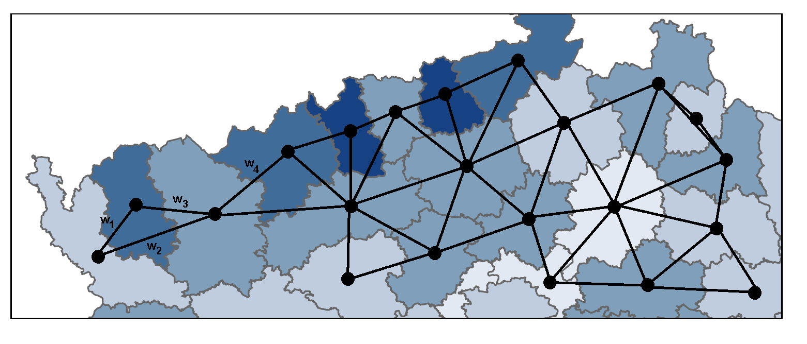
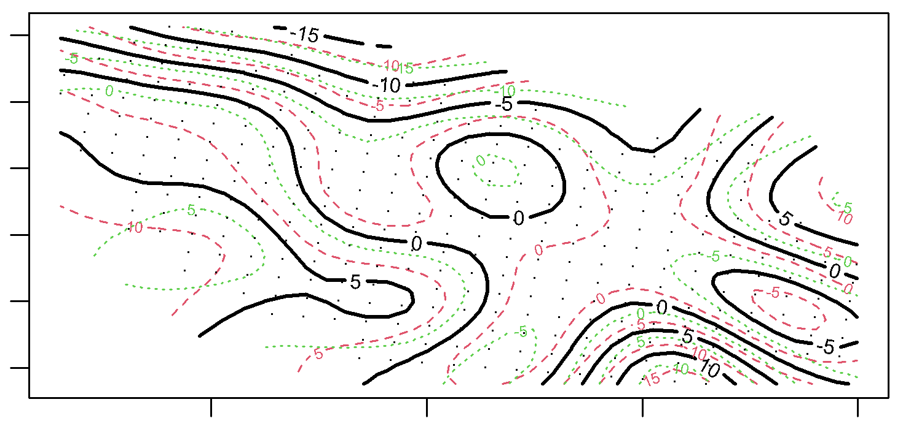
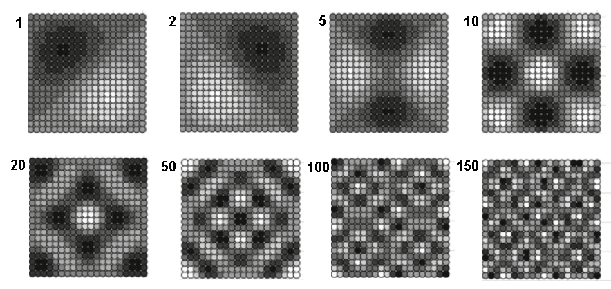

```{r setup, include=FALSE}
knitr::opts_chunk$set(echo = TRUE, warning=F, message=F, cache=T)
```

# General overview

## General model for spatial data
\small

$$\boldsymbol{Y}(\boldsymbol{s})=\boldsymbol{\mu}(\boldsymbol{s})+\boldsymbol{e}(\boldsymbol{s})$$ 

$\boldsymbol{Y}$ ... vector of response observations    
$\boldsymbol{s}$ ... vector of spatial coordinates    
$\boldsymbol{\mu}$ ... deterministic mean function    
$\boldsymbol{e}$ ... random "error" component

The spatial structure observed in $\boldsymbol{Y}$ can be modelled:

- in the **mean component**
    - Spatially structured predictors (induced spatial structure)
    - Autocovariate models
    - Trend surface models
    - Moran's eigenvector mapping
- in the **random component**
    - Geostatistical models
    - Autoregressive models
- both

## Modeling spatial structure in the mean component
\small

Linear models:
\begin{center}
$\boldsymbol{\mu}(\boldsymbol{s}) = \boldsymbol{X}(\boldsymbol{s})\boldsymbol{\beta}$,   $\boldsymbol{e}(\boldsymbol{s}) \sim MVN(\boldsymbol{0},\sigma^2\boldsymbol{I})$
\end{center}

$\boldsymbol{X}(\boldsymbol{s})$ ... matrix of fixed predictors, including spatially structured ones   
$\boldsymbol{\beta}$ ... vector of unknown parameters (fixed effects)

- estimation by *ordinary least squares* (OLS)

Generalized linear models:

1. $Y_i$ are mutually independent, following a common distributional family (Gaussian, Poisson, Binomial, ...)
2. $\boldsymbol{\mu(\boldsymbol{s})} = u[\boldsymbol{X}(\boldsymbol{s})\boldsymbol{\beta}]$, $u$ ... link function

- estimation by maximum likelihood (ML)


## Modeling spatial structure in the random component
\small

$$\boldsymbol{e} \sim (\boldsymbol{0}, \boldsymbol{\Sigma}(\boldsymbol{\theta}))$$ 

- $\boldsymbol{\Sigma}$ is a positive definite matrix with at least some non-zero off-diagonal elements
- $\boldsymbol{\theta}$ is a vector o parameters describing the spatial dependence
- Trying to capture the nature of spatial dependence - the real spatial autocorrelation
- Relies on **stationarity** assumption
- Fixed effects can be estimated by *generalized least squares* (GLS)
- Can be viewed as **mixed models** (estimation by ML/REML)

# Models with correlated errors

## Geostatistical linear model
\small

$$\boldsymbol{\mu}(\boldsymbol{s}) = \boldsymbol{X}(\boldsymbol{s})\boldsymbol{\beta}$$
$$\boldsymbol{e}(\boldsymbol{s}) = \boldsymbol{S}(\boldsymbol{s})+\boldsymbol{\epsilon}(\boldsymbol{s})$$

$\boldsymbol{S}(\boldsymbol{s})\sim MVN(\boldsymbol{0}, \boldsymbol{C})$ ... Gaussian process   
$\boldsymbol{C} = (\sigma_{i,j})$, $\sigma_{i,j} = Cov(S_i, S_j) = C(u)$ ... Covariance function   
$\boldsymbol{\epsilon}(\boldsymbol{s}) \sim MVN(\boldsymbol{0}, \tau^2\boldsymbol{I})$ ... Nugget effect   
$\boldsymbol{\Sigma} = \boldsymbol{C}+\tau^2\boldsymbol{I}$

Covariance function estimated from data:  

- by fitting the curve to the sample variogram (*classical geostatistics*)
- by ML/REML techniques together with other parameters (*model-based approach*)

## Geostatistical linear model
\small

Spatial prediction/interpolation: **kriging**
$$\hat{Y}(\boldsymbol{s}_0) = \boldsymbol{x}'\hat{\boldsymbol{\beta}}_{GLS}+\boldsymbol{c}'\boldsymbol{\Sigma}^{-1}(\boldsymbol{Y}-\boldsymbol{X}\hat{\boldsymbol{\beta}}_{GLS})$$

$\boldsymbol{c} = (C(\boldsymbol{s}_0, \boldsymbol{s}_1),C(\boldsymbol{s}_0, \boldsymbol{s}_2),...,C(\boldsymbol{s}_0, \boldsymbol{s}_n))'$   
$\boldsymbol{c}'\boldsymbol{\Sigma}^{-1}$ ... *kriging weights*   
$var(\hat{Y}(\boldsymbol{s}_0))$ ... *kriging variance*

- Simple kriging ... known constant mean
- Ordinary kriging ... unknown constant mean
- Universal kriging ... unknown mean depending on covariates

## Geostatistical GLM
\small

Generalized linear model (GLM):

1. $Y_i$ ... mutually independent Gaussian/Poisson/Binomial variables
2. $\boldsymbol{\mu(\boldsymbol{s})} = u[\boldsymbol{X}(\boldsymbol{s})\boldsymbol{\beta}]$, $u$ ... link function

Generalized linear geostatistical model (GLGM):

1. $Y_i$ ... mutually independent Gaussian/Poisson/Binomial variables
2. $\boldsymbol{\mu(\boldsymbol{s})} = u[\boldsymbol{X}(\boldsymbol{s})\boldsymbol{\beta} + \boldsymbol{S}(\boldsymbol{s})]$, $u$ ... link function
3. $\boldsymbol{S}(\boldsymbol{s})$ ... Gaussian process with zero mean and some covariance function

- Special case of GLMM


## Autoregressive models
\small

- Based on discrete locations with a **neighborhood structure**
- Magnitude of spatial interactions between neighbors -> **spatial weights**



- Not necessarily areal data...

## Simultanuous autoregressive model
\small

$$\boldsymbol{Y}(\boldsymbol{s}) = \boldsymbol{X}(\boldsymbol{s})\boldsymbol{\beta} + \boldsymbol{e}(\boldsymbol{s})$$
$$\boldsymbol{e}(\boldsymbol{s}) = \boldsymbol{B}\boldsymbol{e}(\boldsymbol{s})+\boldsymbol{\epsilon}(\boldsymbol{s})$$

$\boldsymbol{B}$ ... matrix of spatial dependence parameters, $b_{i,i}=0$   
$\boldsymbol{\epsilon}(\boldsymbol{s})\sim N(\boldsymbol{0}, \sigma^2\boldsymbol{I})$   
$\boldsymbol{\Sigma}_{SAR}=(\boldsymbol{I}-\boldsymbol{B})^{-1}\sigma^2\boldsymbol{I}(\boldsymbol{I}-\boldsymbol{B}')^{-1}$   

Usually:

$$\boldsymbol{B} = \rho\boldsymbol{W}$$

$\rho$ ... single correlation parameter   
$\boldsymbol{W}$ ... matrix of spatial weights

## Conditional autoregressive model
\small

Assumption: Spatial process is *Markov random field*

$$E[Y(\boldsymbol{s}_i)|\boldsymbol{Y}(\boldsymbol{s})_{-i}]=\boldsymbol{x}(\boldsymbol{s}_i)'\boldsymbol{\beta} + \sum_{j=1}^nb_{i,j}[Y(\boldsymbol{s}_j) - \boldsymbol{x}(\boldsymbol{s}_j)'\boldsymbol{\beta}]$$
$$Var[Y(\boldsymbol{s}_i)|\boldsymbol{Y}(\boldsymbol{s})_{-i}] = \sigma^2$$

- $\boldsymbol{\Sigma}_{CAR}=(\boldsymbol{I}-\boldsymbol{B})^{-1}\sigma^2$ 
- Again, usually $\boldsymbol{B} = \rho\boldsymbol{W}$
- In these constant-variance versions, every SAR model can be expressed as a CAR model, and vice versa

# Models with uncorrelated errors

## Autocovariate models
\small

- Each observation is modeled as depending on a summary of neighboring observations
- This *autocovariate* is prepared first a added as a fixed predictor
- A "naive" approach to autoregression
- Typically a weighted average of the neighboring values

- Can be used in any type of model (G)L(M)M, GAM, Random Forests, ...)
- Assumes stationarity

## Trend surface models
\small

- Originally: a simple (linear, quadratic) spatial trend is added as fixed predictor
- Combined with geostatistical models

- Extended to complex, nonlinear smooth surfaces, describing the unexplained spatial structure
- Typically a smooth term `s(x, y)` in a **generalized additive model** (GAM)


{width=40%}


- Description, but not explanation!
- **Does not assume stationarity!**

## Moran's eigenvectors mapping
\small

- PCA applied to the distance or weight matrix
- The resulting variables (called Moran's eigenvectors) used as fixed predictors
- Only those associated with positive eigenvalues (positive spatial dependence)

{width=70%}

- Similar to trend surface models and Fourier transform
- Significant eigenvectors represent spatial dependence at different scales