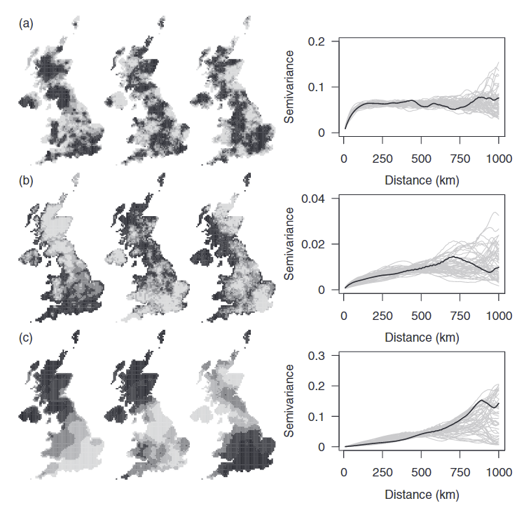
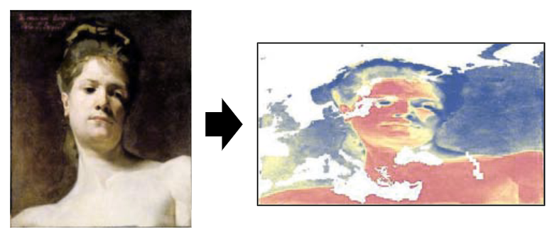
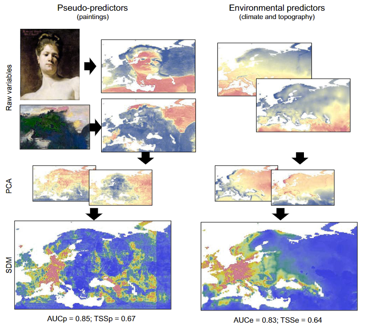

```{r setup, include=FALSE}
knitr::opts_chunk$set(echo = F, warning=F, message=F, cache=T)
```

```{r, echo=F}
library(RandomFields)
library(sf)
library(stars)
library(tmap)
library(tidyverse)
library(performance)
library(spaMM)
```

# What's the problem?

## SAC - Ecological story

::::{.columns}
:::{.column width="65%"}
\small
**Goal:** 

- modeling the response-predictor relationships

**Problem:** 

- autocorrelation in residuals!

**Explanation:**

- missing covariates?
- inner population/community processes?

**Solution**:

- autoregression...
- coordinates as predictors
:::
:::{.column width="35%"}


:::
::::

## SAC - Geostatistical story

::::{.columns}
:::{.column width="65%"}
\small
**Goal:** 

- interpolating the response

**Problem:** 

- non-stacionary processes

**Explanation:**

- spatial trend?
- missing covariates?

**Solution**:

- modeling trend
- modeling response-predictor relationships
:::
:::{.column width="35%"}
{width=40%}

:::
::::

## Accidental correlations between species and environment
\small

{height=90%}


## Bahn & McGill 2007
\small


::::{.columns}
:::{.column}
- 190 species from NA BBS
- Regression tree models
- Environment vs space
:::
:::{.column}
- Real vs simulated abundances
- Cooccurence with similar vs randomly chosen species
:::
::::


## Chapman 2010
\small


{width=40%}

Data:

- 100 UK plant species at 10x10 km grid
- 23 climatic variables
- simulated variables with same properties

Models:

- GLM, random forests
- non-spatial models, trend surfaces, autoregression
- Single predictors, PCA

## Chapman 2010
\small
{height=90%}

## Chapman 2010
\small

{height=90%}

## Chapman 2010
\small

{width=70%}

{height=30%}

## Fourcade, Besnard, Secondi 2018
\small

{width=80%}

- 497 species from European Red List (GBIF)
- real environmental predictors vs paintings



## Fourcade, Besnard, Secondi 2018
\small

{height=80%}

## Fourcade, Besnard, Secondi 2018
\small

{height=90%}

# Can we quantify it?

## Two independent realizations of the same process
\small

{height=75%}

## Two independent realizations of the same process
\small

Gaussian process with Matérn correlation function:

$$\rho(u)=\{2^{\kappa-1}\Gamma(\kappa)\}^{-1}\left(\frac{u}{\phi}\right)^\kappa K_\kappa\left(\tfrac{u}{\phi}\right)$$

$\phi$ ... scale, $\phi>0$

$\kappa$ ... order, $\kappa>0$

::::{.columns}
:::{.column width="50%"}
```{r, echo=F, fig.height=8}
matt <- function(x, nu, phi){ifelse(x==0, 1,(2^(1-nu))*(gamma(nu)^(-1))*(x/phi)^nu*besselK((x/phi), nu))}
x <- seq(0, 1.5, l=200)
data.frame(
  x=rep(x,3),
  y = c(
    matt(x, 0.5, 0.25),
    matt(x, 1.5, 0.16),
    matt(x, 2.5, 0.13)
  ),
  model=factor(c(rep("m1", length(x)), rep("m2", length(x)), rep("m3", length(x))),
          levels=c("m1","m2","m3"))) %>%
  ggplot(aes(x=x,y=y,lty=model)) + 
  geom_line(size=2) +
  scale_linetype_manual(values=1:3, 
                        labels = c(bquote(kappa==0.5~~phi==0.16),
                                   bquote(kappa==1.5~~phi==0.25),
                                   bquote(kappa==2.5~~phi==0.43))) +
  labs(linetype="", x="Distance", y=bquote(rho)) +
  theme_bw() +
  theme(legend.position = c(.7,.7),
        axis.title = element_text(size=30),
        title = element_text(size=28),
        axis.text = element_text(size=26),
        legend.text = element_text(size=30),
        legend.key.width = unit(2,"cm"),
        axis.title.y = element_text(angle=0, vjust=0.5))
```
:::
:::{.column width="50%"}
```{r, echo=F, fig.height=8}
matt <- function(x, nu, phi){ifelse(x==0, 1,(2^(1-nu))*(gamma(nu)^(-1))*(x/phi)^nu*besselK((x/phi), nu))}
x <- seq(0, 1.5, l=200)
data.frame(
  x=rep(x,3),
  y = c(
    matt(x, 1.5, 0.1),
    matt(x, 1.5, 0.2),
    matt(x, 1.5, 0.3)
  ),
  model=factor(c(rep("m1", length(x)), rep("m2", length(x)), rep("m3", length(x))),
          levels=c("m1","m2","m3"))) %>%
  ggplot(aes(x=x,y=y,lty=model)) + 
  geom_line(size=2) +
  scale_linetype_manual(values=1:3, 
                        labels = c(bquote(kappa==1.5~~phi==0.1),
                                   bquote(kappa==1.5~~phi==0.2),
                                   bquote(kappa==1.5~~phi==0.3))) +
  labs(linetype="", x=bquote(u), y=bquote(rho(u))) +
  theme_bw() +
  theme(legend.position = c(.7,.7),
        axis.title = element_text(size=30),
        title = element_text(size=28),
        axis.text = element_text(size=26),
        legend.text = element_text(size=30),
        legend.key.width = unit(2,"cm"))
```
:::
::::


## Two independent realizations of the same process
\small

{height=90%}

## Two different independent processes
\small

{width=80%}

## Two different independent processes
\small


## Two different independent processes
\small


## Two different independent processes
\small

{width=50%}

## Species occurence vs environment
\small

Species **does not** depend on environment:


## Species occurence vs environment
\small

Species **does not** depend on environment:

{height=80%}

## Species occurence vs environment
\small

Species **does not** depend on environment:

{height=30%}
{height=30%}

## Species occurence vs environment
\small

Species **does** depend on environment:

## Ideas... 
\small

- spatial models?
- other SAC parameters?
- other statistics?
- abundance rather than presence absence?
- sample size effect? Spatial resolution effect?
- quantifying SAC in the real environmental and species data!
- real examples...
- practical tools/guidelines...
  - torus translation
  - simulated null models
  - can be causally induced autocorrelation "traced"?


